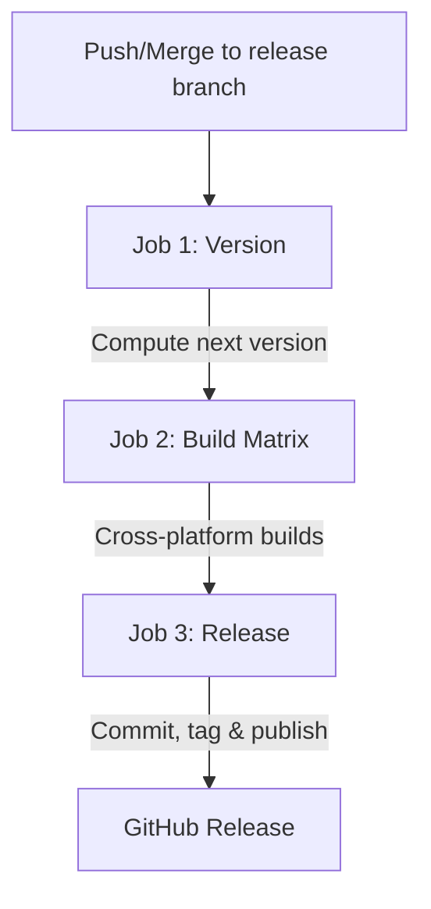

# TinyTools Release & Publication Guide

This document describes the automated release pipeline for TinyTools to help future developers and agentic assistants understand, maintain, and trigger the release process.

---

## Pipeline Overview

The release process is fully automated via GitHub Actions in [`.github/workflows/build.yml`](./TinyTools/.github/workflows/build.yml). It is triggered by pushing changes to the `release` branch (typically via a squash-merged or regular-merged Pull Request).

The pipeline executes in three sequential, dependent stages:

### 1. Version Computation (`version`)
*   **Trigger**: Push to `release` branch, or manual trigger via `workflow_dispatch`.
*   **Action**: Runs [`scripts/compute-next-version.cjs`](./TinyTools/scripts/compute-next-version.cjs) on `ubuntu-latest`.
*   **Logic**:
    *   Finds the last git tag using `git describe`.
    *   Walks all commit messages from the last tag to `HEAD`.
    *   Determines the next version based on **Conventional Commits**:
        *   `!` or `BREAKING CHANGE:` -> `major` bump
        *   `feat:` -> `minor` bump
        *   `fix:` -> `patch` bump
        *   If no conventional commits match, it defaults to a `patch` bump.
    *   If manually triggered with a version override, it skips scanning and uses the specified override.
*   **Result**: Outputs `new_version`, `tag_name` (e.g. `v0.1.1`), and `bump_type`. *Nothing is written to the repository at this stage.*

### 2. Cross-Platform Builds (`build`)
*   **Trigger**: Success of the `version` job.
*   **Matrix**: Runs on `windows-latest`, `macos-latest`, and `ubuntu-22.04`.
*   **Action**:
    1.  Checks out the `release` branch.
    2.  Runs [`scripts/apply-version.cjs <new_version>`](./TinyTools/scripts/apply-version.cjs) to update all configuration files in-place:
        *   `package.json` & `package-lock.json`
        *   `src-tauri/tauri.conf.json`
        *   `Cargo.toml` (root workspace)
        *   `src-tauri/Cargo.toml`
        *   `crates/image-core/Cargo.toml`
        *   `src-wasm/Cargo.toml` (if it contains a `[package]` table)
        *   Regenerates `Cargo.lock` by running `cargo update --workspace`.
    3.  Builds the desktop installers (`.msi`, `.exe`, `.deb`, `.AppImage`, `.dmg`).
    4.  Extracts and packages the `--serve` homelab server binary into versioned archives:
        *   Windows: `tinytools-server-v<version>-windows-x64.zip`
        *   Linux: `tinytools-server-v<version>-linux-x64.tar.gz`
        *   macOS (Apple Silicon): `tinytools-server-v<version>-macos-arm64.zip`
    5.  Uploads all assets as workflow artifacts.
*   **Safe Failure**: If any platform build fails, the pipeline aborts. No changes are committed or tagged in the repository.

### 3. Release Publication (`release`)
*   **Trigger**: Success of all build matrix jobs.
*   **Action**:
    1.  Checks out the `release` branch with write permissions.
    2.  Applies the version bump changes using `scripts/apply-version.cjs`.
    3.  Commits the changes with the message `chore(release): bump version to <version> [skip ci]` using the GitHub Actions bot identity.
        *   *Note: Including `[skip ci]` is critical to prevent recursive workflow triggers.*
    4.  Tags the commit with the release version (e.g. `v0.1.1`).
    5.  Pushes both the commit and tag back to the `release` branch.
    6.  Downloads the matrix artifacts and publishes a new GitHub Release with auto-generated release notes.

---

## Guide for Future Agents and Developers

### How to trigger a Release
1.  **Branch Protection**: The `release` branch should be protected. Direct pushes to `release` should be blocked.
2.  **Pull Request**: Create a PR from `main` (or a feature branch) to `release`.
3.  **Merge**: When the PR is merged, the release pipeline will run automatically, calculate the version, build the installers, commit the version files, tag the repository, and publish the release.

### Manual Overrides
If you need to force a specific version bump type (e.g. force a `major` or `minor` release even if commit messages don't specify it):
1.  Navigate to your repository's **Actions** tab.
2.  Select the **Build & Release** workflow.
3.  Click **Run workflow**.
4.  Choose the `release` branch and select the desired `bump_override` option (`patch`, `minor`, or `major`).

### Maintaining Version Files
If you add new version-bearing files (e.g., new cargo crates or sub-packages) in the future:
1.  Ensure the file is added to the list in [`scripts/apply-version.cjs`](./TinyTools/scripts/apply-version.cjs).
2.  Verify that it follows standard `[package]` versioning conventions if it is a Cargo file.
